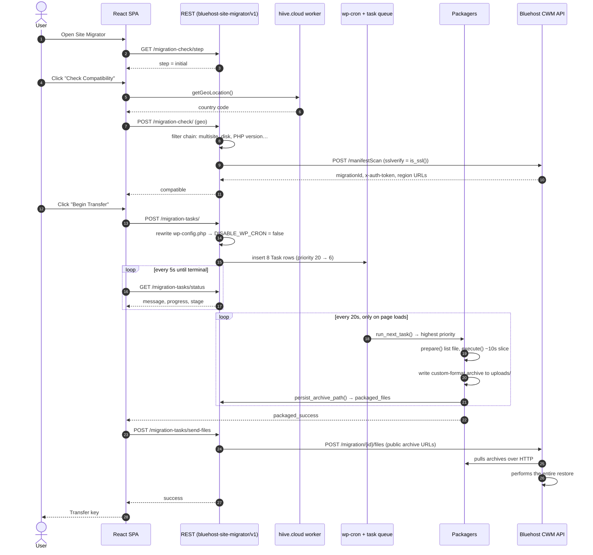

# Bluehost Site Migrator — Code Analysis

**Analysed:** 2026-08-18, updated 2026-08-21 · **Commit:** `87e9a6e` · **Repo version:** 1.0.13

> Originally written against the archived `newfold-labs/bluehost-site-migrator`
> repo. Carried into this working copy at the same commit; the 2026-08-21 update
> adds section 2.7 after `vendor/` became available for review.

A review of the plugin's viability as a migration tool, a register of defects found in
the source, and a proposed refactor plan. Line references are against commit `87e9a6e`.

---

## Contents

1. [Verdict on usefulness](#1-verdict-on-usefulness)
2. [Critical defects](#2-critical-defects)
3. [Lower-severity findings](#3-lower-severity-findings)
4. [Refactors worth doing](#4-refactors-worth-doing)
5. [Recommendation](#5-recommendation)
6. [How these findings were verified](#6-how-these-findings-were-verified)
7. [Migration flows](#7-migration-flows)

---

## 1. Verdict on usefulness

> For the end-to-end journey — how the current flow works and what replaces it —
> see [§7](#7-migration-flows).

**As a general-purpose WordPress migration tool: no.** As a Bluehost customer-acquisition
funnel it was fit for purpose in 2023, but it is not viable today.

| Signal | Value |
|---|---|
| wp.org released version | **1.0.14**, last updated **2023-10-03** |
| Tested up to | **6.2.11** |
| Ratings | **26/100** — 25 of 29 reviews are 1-star |
| Downloads | 121,134 |
| Last functional code commit (`includes/`, `src/`) | **2023-09-08** (everything since is CI/dependabot) |
| Backend API cert (`cwm.eigproserve.com`) | **expired 2024-07-26** — server answers TCP, TLS fails |

Two structural points on top of that:

**It is one-directional and vendor-locked.** The plugin only packages a site and hands a
"transfer key" to Bluehost's CWM (Can We Migrate) service. There is no import side in this
codebase. If CWM is not answering, the archives it produces are inert. Compare with
All-in-One WP Migration (which this is a clear derivative of — the `a255/a14/a12/a4096`
block header and the `wbk_*` Webba Booking table special-case at `DatabaseDumper.php:70`
are lifted from it) or Duplicator, both of which produce a self-contained restorable package.

**`master` is not what shipped.** Tag `1.0.14` lives on `origin/release/1.0.14`, a divergent
older lineage (it still contains `tests/cypress/integration/` and a different webpack config).
`master` is the 1.0.13 "rewrite_plugin" branch. The rewrite in this repo was effectively
never released.

### Why the reviews are 1-star

A specific code path converts a backend outage into a silent, hours-long failure.
`MigrationChecks/Checker.php`:

```php
if ( is_wp_error( $response ) ) {
    self::$results['cwm_api'] = $response->get_error_message();
    return $can_migrate;   // ← returns TRUE, unchanged
}
```

With the expired certificate, `wp_remote_post` fails. The user is nonetheless told
"Look's like we're compatible!", packaging runs for potentially hours, and then
`send_files` POSTs to `/migration//files` with an empty migration ID and fails — landing on
"It looks like your site didn't transfer. Call us at 888-401-4678."

**A dead backend is indistinguishable from a successful compatibility check until after the
entire site has been packaged.**

---

## 2. Critical defects

Ordered by damage. The first three are showstoppers independent of the backend.

### 2.1 Clicking "Start Transfer" can take the site down

**`includes/MigrationManager/MigrationTasks.php:25-32`**

```php
$config_file_path = ABSPATH . 'wp-config.php';
$config_content   = $wp_filesystem->get_contents( $config_file_path );
$config_content   = preg_replace( '/define\(\s*\'DISABLE_WP_CRON\'\s*,\s*true\s*\);/', ..., $config_content );
$wp_filesystem->put_contents( $config_file_path, $config_content );
```

On the very common layout where `wp-config.php` sits one directory *above* `ABSPATH`,
`get_contents()` returns `false`, `preg_replace` yields `''`, and this **writes an empty
`wp-config.php` into the WordPress root**. `wp-load.php` checks `ABSPATH . 'wp-config.php'`
first, finds the empty file, and the site drops to the install screen. Fatal, and hard for a
non-technical user to diagnose.

`Utils\Common::locate_wp_config_file()` exists and handles exactly this case — it is simply
not used here.

Secondary problems in the same eight lines:

- `WP_Filesystem()` can return false, leaving `$wp_filesystem` null → fatal on PHP 8.
- The edit is never reverted after migration.
- No backup of `wp-config.php` is taken.

**Fix direction:** editing a user's `wp-config.php` to flip a cron constant is the wrong
mechanism entirely. Use `spawn_cron`/loopback requests, detect `DISABLE_WP_CRON` and inform
the user, or drive the queue from the admin side.

### 2.2 The resumable-chunking engine does not resume

**`includes/Archiver/Compressor.php:35`**

```php
public function add_file( $file_name, $new_file_name = '', $file_written = 0, $file_offset = 0, ... )
```

`$file_written` and `$file_offset` are **passed by value**. Upstream (All-in-One WP Migration)
declares them `&$file_written, &$file_offset`. The `&` was dropped in the port, and every
caller depends on them being references:

```php
// includes/Packager/DatabaseArchiver.php:36,85
$database_bytes_written = 0;
$completed = $archive->add_file( $database_dump_path, 'database.sql', $database_bytes_written, $database_bytes_offset );
```

Consequences:

- **`$file_written` is always 0** in the caller, so `$processed_files_size` never grows and
  every progress percentage computed from it is permanently 0.
- **`$file_offset` never advances**, so a file that hits the 10-second budget restarts from
  byte 0 on the next pass — re-writing its header block and its content into the archive again.
- In `DatabaseArchiver` this is an **unbounded loop**: the stored `database_bytes_offset` is
  always 0, `self::execute()` recurses (line 137), and each pass appends another copy of the
  dump until the disk fills. Any SQL dump that cannot be copied in 10s triggers it.

Note that the "Compressor" does not actually compress — it is a raw byte copy into a custom
container — so this is purely disk-speed-bound.

### 2.3 `self::execute()` recursion cancels out the chunking it exists to support

All eight packagers end with `self::execute()` when incomplete
(`UploadsArchiver.php:343`, `DatabaseDumper.php:270`, and six others).

The entire 10-second-budget design exists so each cron tick does a slice and yields.
Recursing in-process means the request never yields — it runs until PHP's
`max_execution_time` kills it, with stack depth growing per slice.

This also creates a real corruption path: a task request running past
`WP_CRON_LOCK_TIMEOUT` (60s) lets WordPress spawn a **second concurrent cron process** for the
same task. Both loaded the same offsets from `Options`, both append to the same archive, and
the last one to shut down wins the offset write.

**Fix direction:** `return` instead of recursing, and let the task queue re-invoke. That is
what the queue is for.

### 2.4 `wp-config.php` is archived and published to a public URL

**`includes/Packager/RootArchiver.php:57-98`**

```php
$exclude_filters = array( ABSPATH . 'index.php', ..., ABSPATH . 'wp-config.php', ... );  // full paths
...
if ( in_array( $file->getFilename(), $exclude_filters, true ) ) { return false; }        // basenames
```

`getFilename()` returns `wp-config.php`; the array holds `/var/www/html/wp-config.php`.
Strict comparison, never matches. **Nothing in that exclusion list is actually excluded**,
including `wp-config.php` with its DB credentials and auth salts. (`UploadsArchiver` gets this
right — it compares a bare directory name.)

That archive is written to `wp-content/uploads/bluehost-site-migrator/`, and its **public URL**
is computed and POSTed to CWM (`PackagerBase.php:46`) because the remote fetches it over HTTP.
The only protection is filename secrecy, and the filename is
`backup-{Y-m-d-His}-{sitename}-{uniqid}-root.zip` where `uniqid()` (`functions.php:173`) is
derived from the same microtime as the timestamp already printed in the name — so an attacker
who knows the second is brute-forcing roughly 2^20 microsecond values, not a real secret.

The `index.php` "silence is golden" file (`functions.php:188`) prevents directory listing on
Apache and does nothing to stop direct file access anywhere.

**Scope, precisely.** `RootArchiver` returns `false` for any entry with children, so it never
descends — it captures **top-level files in `ABSPATH` only**, and no archiver anywhere walks
`wp-admin/` or `wp-includes/`. (Contrast `PluginsArchiver`, whose filter returns `true` for
directories in order to recurse.) So WordPress core is *not* being shipped; the archive is a
handful of root files. That makes the blast radius smaller than it first looks, but it does not
soften the finding: the one file that must never leave the server is in there, and the part is
only a few kilobytes once the filter is fixed.

Also on the exposure surface: the plaintext `.sql` dump and the `.list` CSVs stay in that
directory indefinitely — they are only removed on cancel or deactivation.

### 2.5 TLS verification is tied to the wrong thing

**`includes/MigrationChecks/Checker.php:63`, `includes/RestApi/MigrationTasksController.php:181,253`**

```php
'sslverify' => is_ssl(),
```

Whether the *local* site is served over HTTPS has no bearing on whether the *remote* API's
certificate should be verified.

- On an HTTP site this silently disables certificate verification while transmitting the
  manifest and the `x-auth-token`.
- On an HTTPS site it enables verification — which, with the currently-expired cert, is what
  makes the plugin fail for essentially every modern install.

Should be `true`, unconditionally.

### 2.6 Any first-load API failure blanks the admin screen

**`src/components/Migration.js:29-43`**

```js
if ( response.failed ) {
    setStepResult( { loading: false, error: response.error, failed: true } );
}
setStepResult( { loading: false, compatible: response.compatible, ... } );   // ← no return above
```

The missing `return` means the error state is immediately overwritten with all-`undefined`
fields. Every guard then falls through, the component returns `undefined`, and React throws
*Nothing was returned from render*. This is precisely the path taken when the backend is
unreachable — i.e. today.

`src/components/transfer/TransferSuccess.js` has the same missing-return after
`navigate('/error')`, plus `for (const region of response.regions)` which throws when
`regions` is `null` (its stored default).

Separately, `navigate()` is called during render rather than from an effect — should be
`<Navigate to=... replace />`.

---

### 2.7 The task queue cannot recover from a stuck task, and one stuck task stops everything

Reviewed in `vendor/newfold-labs/wp-module-tasks` **1.0.4**. Three defects in the module
compose into a permanent, silent stall of the whole migration.

**(a) The stuck-task recovery query is malformed and can never run.**
`Task::get_timed_out_tasks()` builds its SQL in a *double-quoted* PHP string but escapes the
quotes as though it were single-quoted:

```php
// vendor/newfold-labs/wp-module-tasks/includes/Models/Task.php
$stuck_tasks = $wpdb->get_results(
    "SELECT * FROM `{$wpdb->prefix}{$table_name}` WHERE task_status = \'processing\' AND updated < DATE_SUB(NOW(), INTERVAL 10 MINUTE)"
);
```

`\'` is not a recognised escape sequence in a double-quoted PHP string, so PHP emits the
backslash literally (verified — see section 6). The SQL that reaches MySQL is
`WHERE task_status = \'processing\'`, where a bare backslash is not valid at that position.
The query errors, `get_results()` returns `null`, and `Scheduler::cleanup()` — the *only*
mechanism that unwedges a stuck task — iterates `null` and does nothing. It has never worked.

**(b) `Scheduler::run_next_task()` head-of-line blocks.** It selects the single
highest-priority row, then:

```php
if ( 'processing' === $task_data->task_status ) {
    return;
}
```

It returns rather than moving to the next task. Any row stuck in `processing` halts the
entire queue, not just its own work.

**(c) There is no lock.** The check-then-set between that status read and
`$task->update_task_status( 'processing' )` is not atomic and not transactional. Two cron
ticks racing — which wp-cron does readily, since it fires on concurrent page loads — can both
read `queued` and both execute the same task. For a packager that means two writers appending
to the same archive from the same byte offsets.

**How they compose.** A packager that overruns PHP's `max_execution_time` dies on a fatal
error, not an `\Exception`. `run_next_task()`'s `catch ( \Exception )` does not fire, so its
`finally { $task->delete(); }` never runs either, and the row is left in `processing`
forever. (b) then makes every subsequent tick a no-op, and (a) means the 10-minute cleanup
can never rescue it. Packaging stops permanently while the SPA keeps polling `/status` and
reporting the last percentage it saw. This is the mechanism behind the "stuck at N%" reports.

Note that the schema is *designed* for this recovery to work —
`updated TIMESTAMP NOT NULL ON UPDATE CURRENT_TIMESTAMP` means `update_task_status()`
refreshes the timestamp exactly as the 10-minute window expects. Only the query is broken.

**Also in this module:**

- **wp-cron is not a timer.** `wp_schedule_event( time(), 'twenty_seconds', ... )` only runs
  when someone requests a page. On a low-traffic site the SPA's own `/status` polling is what
  keeps the queue moving — so closing the browser tab stops packaging. The progress UI is
  load-bearing infrastructure, not just a display.
- `run_next_task()` calls `$wpdb->prepare()` on a query with no placeholders and no
  arguments, which triggers a `_doing_it_wrong` notice on every tick (every 20s).
- *Suspected, unverified:* the tasks table declares `updated TIMESTAMP NOT NULL` with no
  `DEFAULT` (unlike the results table, which has one), while `queue_task()`'s `INSERT` omits
  the column. Under MySQL 8 defaults (`explicit_defaults_for_timestamp=ON`) plus strict mode
  that is a "field doesn't have a default value" error, which would break task queueing
  outright. Needs a live database to confirm.

**Implication for the rework.** These are upstream defects in a Newfold-hosted dependency,
not in this plugin's own code — so they are not directly fixable here. Dropping the queue in
favour of a WP-CLI entry point removes the dependency (and the Satis repo requirement) rather
than working around it.

---

## 3. Lower-severity findings

| # | Finding | Location |
|---|---|---|
| 3.1 | **`append_eof()` is inverted** — throws on the *success* branch, and checks `strlen() !== false` on the failure branch. It always throws. Latent only because no caller passes `close( true )` — which means no archive ever gets its EOF block, so `is_valid()` would return false for every archive the plugin produces. | `Archiver/Archiver.php:155` |
| 3.2 | **Handle leaks / unfinalized archives** — `DatabaseArchiver`'s success path never calls `$archive->close()`; `UploadsArchiver`'s `feof` branch never `fclose()`s the list file. | `Packager/DatabaseArchiver.php`, `Packager/UploadsArchiver.php` |
| 3.3 | **Autoloaded state blob** — `update_option( ..., true )` forces `autoload=yes` on a blob containing the full manifest (every plugin and theme with descriptions), all task params, and `packaged_files`. Tens to hundreds of KB loaded on **every** request, persisting until deactivation. | `Utils/Options.php:83` |
| 3.4 | **`Status::set_status()` inside the per-file loop** — one `update_option()` per archived file. On a 50k-file uploads directory that is 50k writes of a barely-changing value. | all `Packager/*Archiver.php` |
| 3.5 | **Progress is theatre** — nearly every `set_status()` call passes a hardcoded band (`55`, `58`, `60`, `62`…). The computed `$progress` variable is dead in all but one place. | all packagers; live use only at `DatabaseDumper.php:246` |
| 3.6 | **Placeholder/argument mismatch** — `vsprintf` with **9** `%s` against `BH_SITE_MIGRATOR_OPTIONS_LIST`'s **10** entries. The 10th (`bh_site_migrator_redirect`) is not excluded and rides along into the exported dump. | `Packager/DatabaseDumper.php:194` |
| 3.7 | **Division by zero** — divides by `filesize()` of the dump with no zero guard; fatal on PHP 8 if the dump came out empty. | `Packager/DatabaseArchiver.php` |
| 3.8 | **`esc_xml()` requires WP 5.5+** and is used 35 times across archiver error paths, but the plugin header claims `Requires at least: 4.7`. On WP < 5.5 every error path fatals with an undefined function. (`Requires PHP: 5.6` vs phpcs `testVersion 7.0-` is inconsistent too.) | `bluehost-site-migrator.php`, `Archiver/*`, `Packager/*` |
| 3.9 | **Text domain typo** — `bluehost_site_migrator` (underscores) means those two menu strings can never be translated. Many other user-facing strings are not wrapped at all (`'Cloning your website'`, `'Check Compatibility'`, `'Done retrieving a list of WordPress root files.'`). | `WP_Admin.php:32-33` |
| 3.10 | **`wp_safe_redirect()` without `exit`**, firing on every `admin_init` including AJAX — and it hijacks bulk plugin activation. | `functions.php` (redirect handler) |
| 3.11 | **Dead/unsafe code** — `add_file()`'s `$encrypt` / `$encrypt_pass = 'pass'` parameters are never used with a real key; `nfd_bhsm_encrypt_string()` would encrypt each 512KB chunk under an independent IV, which no extractor could reverse. `Archiver` defines `replace_forward_slash_with_directory_separator()` etc. as protected methods *and* `functions.php` defines them again as globals — `Compressor` calls the globals. | `Archiver/Compressor.php:35`, `functions.php` |
| 3.12 | **`set_time_limit( 90 )` buried in a getter** (`nfd_bhsm_get_dir_size`). | `functions.php:224` |
| 3.14 | **Licence hygiene, not a code defect, but it ships with the code.** There is **no `LICENSE` file in the repository**, though the plugin header declares `GPL-2.0-or-later`. Separately, `Database/DatabaseBase.php` and `Archiver/` are derived from All-in-One WP Migration (GPL) and carry **no attribution** — no upstream notice, no fork point, no mention of ServMask anywhere in the tree. They arrived in a single commit (`41f4196`, 2023-08-21, "feat: database, archiver and compresssor classes") with the origin already stripped. GPL redistribution requires preserving notices; the rename and re-release is the moment to fix it, not to compound it. `DatabaseBase` is code the plan explicitly keeps. | repository root; `Database/DatabaseBase.php`; `Archiver/` |
| 3.16 | **REST URLs built by concatenation break on plain permalinks.** `rest_url()` returns `/index.php?rest_route=/ns/v1/` when a site has no permalink structure, so `${restUrl}export/download?file=…` produces a second `?`, which WordPress folds into the value of the first and answers "no route was found". Shipped in Phase 3: the download buttons on the export screen did nothing on any plain-permalink site, which is a large fraction of them. Both callers now go through one helper that picks `?` or `&` by inspecting the base. | `src/utils/api.js` |
| 3.15 | **`DatabaseUtility::replace_serialized_values()` could never have run on PHP 7 or later.** The recursion passes itself arrays and objects, and since PHP 8.0 `unserialize()` throws a `TypeError` when given one. A `TypeError` is an `Error`, not an `Exception`, so the function's own `catch ( \Exception $e )` — placed there precisely to make it robust — does not stop it. The first serialized option in the database takes the whole request down. Dead since the fork, so nothing had ever executed it; found the moment Phase 4a gave it a caller. Fixed by guarding on `is_string()` and testing `is_serialized()` before the call rather than after it. | `Utils/DatabaseUtility.php:48` |
| 3.13 | **The import half's scaffolding is present and dead.** `DatabaseBase::replace_table_collations()` downgrades incoming collations to what the *local* server supports (`utf8mb4_0900_ai_ci` → `utf8mb4_unicode_520_ci` → `utf8mb4_unicode_ci` → `utf8_unicode_ci` via `$wpdb->has_cap()`) and has **zero call sites**, as do the `is_*_query()` predicates reachable only from the uncalled `is_atomic_query()`. This is leftover import code from the All-in-One WP Migration fork. Two latent problems if it is revived as-is: it does not know MariaDB's `utf8mb4_uca1400_*` collations, and its `utf8mb4` → `utf8` step silently truncates 4-byte characters (emoji, much CJK) with no warning. | `Database/DatabaseBase.php:1160`, `:1291` |

---

## 4. Refactors worth doing

### 4.1 Collapse the six file archivers into one

`Uploads`, `Themes`, `Plugins`, `MuPlugins`, `Dropins`, and `Root` are ~330 lines each and
**~85% identical** — a normalized diff between `UploadsArchiver` and `ThemesArchiver` is 170
lines out of 683. They differ only in: source directory (or directories), exclude filter,
status messages, and the hardcoded progress band.

A `FileListArchiver` base with a template method plus a small per-type config array takes
**~1,700 lines to ~250** — and, critically, means each of the bugs above is fixed **once**
rather than six times. The exclusion bug in [2.4](#24-wp-configphp-is-archived-and-published-to-a-public-url)
exists precisely because these were copy-pasted and one copy diverged.

### 4.2 Make the offset state an object, not a bag of scalars

Every packager repeats twelve `if ( isset( $params['x'] ) ) { $x = (int) $params['x']; } else { $x = 0; }`
blocks, then twelve mirrored `$params['x'] = $x;` writes.

A `PackagingState` value object with typed accessors and `load()`/`save()` removes ~150 lines
per archiver and makes the by-reference bug in [2.2](#22-the-resumable-chunking-engine-does-not-resume)
structurally impossible — state advances by method call, not by hoping a parameter was
declared with `&`.

### 4.3 Replace the custom container format with `ZipArchive`

The custom `a255/a14/a12/a4096` format exists to support mid-file resume, but that resume is
broken (2.2) and the format is not actually compressed. `ZipArchive` is available on
effectively every host that meets the plugin's own `zlib` requirement, produces something the
user can open and verify, and deletes `Archiver` + `Compressor` (563 lines) outright.

If per-file resume genuinely matters, resume at *file* granularity rather than byte
granularity — far simpler and sufficient, since the pathological case is many files, not one
enormous one.

### 4.4 Change the handoff from pull to push

The "write to a public uploads URL and tell the remote to fetch it" design is what forces the
archives to be world-readable. Having the plugin PUT to a pre-signed, expiring URL lets the
archives live outside the webroot (or behind a deny rule), removes filename-guessing as the
only control, and allows deleting artifacts immediately after transfer.

This is the change that **retires** finding 2.4 rather than patching it.

### 4.5 Move state off the single autoloaded option

Split volatile packaging state into a non-autoloaded option (or a custom table, which the
tasks module already provides infrastructure for), and keep only small config in the
autoloaded blob. Add optimistic locking, or accept that the read-once/write-whole-array
pattern loses writes under concurrent cron.

### 4.6 Fail the compatibility check when the API is unreachable

Returning `$can_migrate` unchanged on `WP_Error` is what converts a backend outage into hours
of wasted packaging and a support call. It should return `false` with an actionable message.

### 4.7 Add PHP tests

There are none. The Cypress suite stubs the REST layer completely, so the ~3,000 lines of
packaging engine — the part that writes files, edits `wp-config.php`, and loops — has **zero**
coverage. The archiver is pure enough to unit-test against a fixture directory; that alone
would have caught 2.2 and 2.4.

### 4.8 Raise the PHP floor to 7.4+

`Requires PHP: 5.6` is holding the codebase to `array()` syntax and no type declarations while
WordPress itself has long moved on. Pair this with a PHP 8.x deprecation audit.

---

## 5. Recommendation

**If the goal is migrating WordPress sites:** use All-in-One WP Migration, Duplicator, or a
host-native tool. This plugin cannot complete a migration today regardless of code quality,
because the service it depends on is not serving a valid certificate and has not been touched
in three years.

**If the goal is reviving this for Bluehost**, in order:

1. Confirm CWM is still operated at all. This is a business question, and it gates everything else.
2. Fix [2.1](#21-clicking-start-transfer-can-take-the-site-down) and
   [2.4](#24-wp-configphp-is-archived-and-published-to-a-public-url) — actively harmful to
   users who install the current build.
3. Fix [2.2](#22-the-resumable-chunking-engine-does-not-resume) and
   [2.3](#23-selfexecute-recursion-cancels-out-the-chunking-it-exists-to-support) — why large
   sites never finish.
4. Then the refactors in section 4.

**If CWM is decommissioned**, the right move is to close the wp.org listing rather than leave
a plugin that bricks configs and publishes `wp-config.php`.

---

## 6. How these findings were verified

Reproduction commands for the external/environmental claims:

```bash
# Backend API certificate — expired 2024-07-26
echo | openssl s_client -connect cwm.eigproserve.com:443 -servername cwm.eigproserve.com 2>/dev/null \
  | openssl x509 -noout -subject -issuer -dates

# Server is reachable, so this is a cert problem and not a decommissioned host
nc -z -v -w 5 cwm.eigproserve.com 443

# wp.org release metadata and ratings
curl -s "https://api.wordpress.org/plugins/info/1.0/bluehost-site-migrator.json" | python3 -m json.tool

# Released tag is a divergent lineage from master
git branch -a --contains 1.0.14
git diff --stat master 1.0.14

# Last functional (non-CI) change to plugin code
git log -1 --date=short --pretty='%ad' -- includes/ src/

# 2.7(a) — the backslashes survive PHP into the emitted SQL.
# (Heredoc, not `php -r`: the nested quotes are the whole point and a -r one-liner
#  cannot express them.)
cat > /tmp/t.php <<'PHPEOF'
<?php
$prefix = 'wp_'; $table_name = 'nfd_tasks';
$q = "SELECT * FROM `{$prefix}{$table_name}` WHERE task_status = \'processing\' AND updated < DATE_SUB(NOW(), INTERVAL 10 MINUTE)";
echo $q, "\n";
PHPEOF
php /tmp/t.php
# -> SELECT * FROM `wp_nfd_tasks` WHERE task_status = \'processing\' AND updated < ...
#    The backslashes are still there; MySQL rejects a bare backslash at that position.

# Duplication between archivers: 170 differing lines out of 683
diff <(sed 's/uploads/XX/g;s/Uploads/XX/g' includes/Packager/UploadsArchiver.php) \
     <(sed 's/themes/XX/g;s/Themes/XX/g' includes/Packager/ThemesArchiver.php) | wc -l
```

### Scope and caveats

- This review covers the plugin source in `includes/`, `src/`, `functions.php`, and
  `constants.php`.
- **`newfold-labs/wp-module-tasks` 1.0.4 was reviewed** as of 2026-08-21, once `vendor/`
  was available; see 2.7. The rest of `vendor/` was not reviewed.
- Findings were identified by reading the source, not by executing the packaging pipeline
  against a live site. The defects in section 2 are traceable in code; their runtime
  thresholds (e.g. how large a database must be to trigger 2.2) will vary with host disk speed.

---

## 7. Migration flows

### 7.1 Current flow

The whole journey lives on one wp-admin page. `Migration.js` fetches
`/migration-check/step` and picks a screen from the returned state
(`compatible` / `checked` / `transfer_queued` / `packaged_success` / `packaged_failed`).



**Packaging order** (descending `task_priority`):

| Priority | Task | Class |
|---|---|---|
| 20 | `package_database` | `DatabaseDumper` |
| 18 | `archive_database` | `DatabaseArchiver` |
| 16 | `archive_plugins` | `PluginsArchiver` |
| 14 | `archive_themes` | `ThemesArchiver` |
| 12 | `archive_uploads` | `UploadsArchiver` |
| 10 | `archive_mu_plugins` | `MuPluginsArchiver` |
| 8 | `archive_dropins` | `DropinsArchiver` |
| 6 | `archive_root` | `RootArchiver` |

**What this flow tells you**

- **There is no import half.** The plugin's job ends at "here are URLs to my archives." CWM
  performs the entire restore. Removing CWM therefore does not mean replacing an API call — it
  means writing an importer that has never existed (see the plan's phase 4).
- **The destination is never contacted by the plugin.** There is no second install, no
  handshake, no verification that the target can receive the site.
- **Archives are pulled from public URLs.** That is why `wp-config.php` leaking into
  `root.zip` (finding 2.4) is a disclosure and not just untidiness. Note the archive holds
  only top-level root files — core is never packaged by any archiver — so the fix is a working
  allowlist, not a new exclusion pass.
- **The browser is already load-bearing.** wp-cron only fires on page loads, so the SPA's own
  5-second polling is what keeps the queue advancing. Close the tab and packaging stops — the
  UI is infrastructure, not decoration. The proposed flow makes that honest instead of
  accidental.
- **Three separate failure oracles** — the filter chain's boolean, `Checker::$results`, and the
  `packaged_failed` flag — none of which agree. This is how a false "compatible" (finding 2.5)
  reaches the packaging stage at all.

### 7.2 Proposed flow — v1 (manual download / upload)

The plugin is installed on **both** sites. The **package** is carried by hand — streaming it
between servers is what v2 adds. The **compatibility profile** is a few hundred bytes and is
fetched live over a paired connection, with a manual paste as the fallback when the destination
cannot be reached. Same core drives both halves; the browser is the scheduler. See
`implementation-plan.md` §1.1 for the same sequence in plain language.

```mermaid
sequenceDiagram
    autonumber
    actor U as User
    participant S as Source site
    participant D as Destination site

    rect rgb(255,250,235)
    note over U,D: Pairing — the small check goes over the wire; the package does not
    U->>D: Open Site Migrator → Receive a site → Pair
    D-->>U: Site URL + single-use pairing code
    U->>S: Paste URL + code into Export
    S->>D: GET /profile (code-authenticated, sslverify on, 404 if unauth)
    D->>D: Gather live facts (WP, db_version, PHP, DB, collations, disk)
    D->>D: RENAME TABLE scratch probe → import mode
    D-->>S: Site profile
    S->>S: Compare → gates + warnings + collation plan
    S-->>U: Verdict (green / warn / blocked, with reason)
    opt Gate blocked and fixable
        U->>D: Update core / free disk / raise a limit
        U->>S: Re-check (re-fetches live; no round trip)
    end
    alt Destination unreachable (outbound HTTP blocked, auth wall, no DNS)
        U->>D: Copy profile blob manually
        U->>S: Paste blob → same gates, snapshot instead of live
    end
    end

    rect rgb(240,245,255)
    note over U,S: Export
    U->>S: Start export
    S->>S: create package dir + checkpoint.json
    loop POST /export/step until done (~15s budget each)
        S->>S: manifest → db dump → zip parts → loose large files
        S-->>U: { progress, done, warnings }
    end
    S->>S: checksums → finalize, delete checkpoint
    S-->>U: part list (sizes + SHA-256)
    U->>S: Download parts (authenticated, Range-resumable)
    end

    rect rgb(245,255,245)
    note over U,D: Import — nothing is written until step "Confirm"
    U->>D: Open Site Migrator → Import
    alt Browser upload
        U->>D: Chunked upload of each part (~5MB chunks, resumable)
    else Large-site escape hatch
        U->>D: SFTP parts into the storage dir
        D->>D: scan and detect
    end
    D->>D: verify checksums, read manifest
    D->>D: AUTHORITATIVE compatibility re-check vs live facts
    D-->>U: Preview: URL change, prefix change, user merge plan, warnings
    U->>D: Confirm (explicit destructive-action consent)
    D->>D: write temp mu-plugin, mint file-based token
    loop POST /import/step until done
        D->>D: restore files (dest wp-config never touched)
        D->>D: import SQL into wpimp_ tables (collation downgrade applied)
        D->>D: merge dest users into staged users, remap usermeta, fix prefix keys
        D->>D: serialized-safe search/replace + prefix reconcile ON STAGED TABLES
        D->>D: verify staged: row counts, tables present, login/email uniqueness
        D->>D: atomic RENAME swap — the only destructive instant
        D->>D: post-swap only: recreate views, flush permalinks, validate roles
        D-->>U: { progress, done, warnings }
    end
    D->>D: remove mu-plugin, delete token, keep wpold_ tables for rollback
    D-->>U: Done — logins renamed, manual follow-ups, wp-config block
    U->>D: Confirm success → drop wpold_ (else auto-drop at 30 days)
    end
```

**Key differences from the current flow**

| | Current | Proposed v1 |
|---|---|---|
| Scheduler | wp-cron task queue | The browser, via `POST /*/step` |
| Resumability | Byte offsets in an autoloaded option | `checkpoint.json` on disk |
| Archive format | Custom binary container | Standard zip + loose large files |
| Restore | Performed by CWM | Performed by the plugin |
| Destination | Never contacted | Runs the same plugin |
| External deps | CWM API, hiive.cloud geo, wp-module-tasks | None — the only outbound call is source → destination, and it degrades to a paste |
| Failure signal | Three disagreeing oracles | One structured `Report`, fails closed |

> Before any of this runs, the source **pairs** with the destination and reads its
> **compatibility profile** live — WordPress and `db_version` floors, PHP, collation
> availability, disk space — so a blocked gate surfaces *before packaging* and can be fixed and
> re-checked in place. The destination re-checks authoritatively before its first write. See
> `implementation-plan.md` §8.
>
> The database swap step imports into temp-prefix tables and switches with a single atomic
> `RENAME TABLE`, so a failed import leaves the destination untouched and rollback is a second
> rename. Import is a **full replace** for every table except **users**, which are *merged*:
> destination accounts are kept, source accounts are merged in with their IDs preserved so
> migrated authorship stays intact. `wp-config.php` is never written on either side. See
> `implementation-plan.md` §9 for the reasoning and the fallback when `RENAME TABLE` is
> unavailable.

v2 replaces the manual download/upload band with a direct pull from destination to source; v3
drives the identical core from WP-CLI. Neither changes the shape above.

